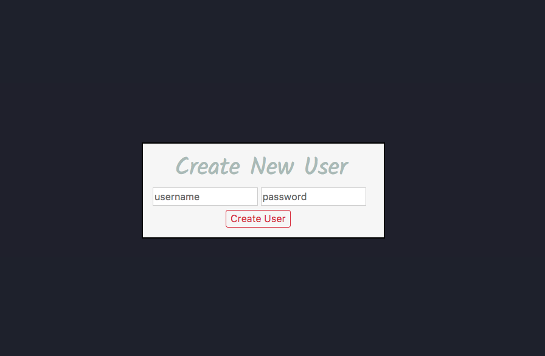

# SpaceGhostFaces
Facebook for my GA classmates
Skeleton-Hunt

Inspired by Facebook. Goal was to create a basic social media platform.

### Deployment

Heroku is a cloud platform that was used to host my web application. To view live, visit https://space-ghost-faces.herokuapp.com/

### Technologies Used

- HTML
- CSS
- JavaScript
- Atom
- Bootstrap.
- Mongo
- Mongoose
- Express
- EJS

# Registration
To get access to the social media site you must first register.
Once registered you go back to the log in page and begin editing your personal page.
To view all profiles, click the SpaceGhost icon on the top left corner.

# Approach

I started the project with the Authentication Build. I wanted that to be a necessity in order to access the website.

### Author

#### Hector Guevara https://github.com/hectorlito

### Future Goals
- Adding more styling.
- Making it look a bit more professional.
- Elaborating on the social media concept. Such as allowing for comments, multiple photos, groups etc.

### Credits and Thank yous

Everyone that helped and tested for me. Too many people to name.
