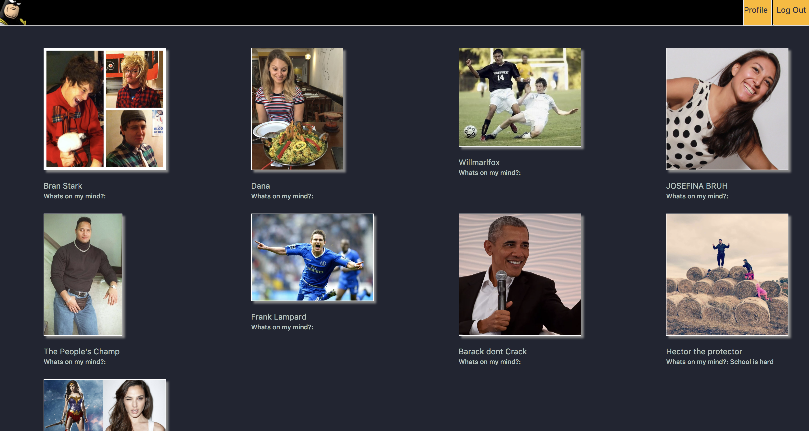

# SpaceGhostFaces
Facebook for my GA classmates
Skeleton-Hunt

Inspired by Facebook. Goal was to create a basic social media platform.

### Deployment

Heroku is a cloud platform that was used to host my web application. To view live, visit https://space-ghost-faces.herokuapp.com/

### Technologies Used

- HTML
- CSS
- JavaScript
- Atom
- Bootstrap.
- Mongo
- Mongoose
- Express
- EJS

# Registration
To get access to the social media site you must first register.
Once registered you go back to the log in page and begin editing your personal page.
To view all profiles, click the SpaceGhost icon on the top left corner.

# Approach

I started the project with the Authentication Build. I wanted that to be a necessity in order to access the website.

After I got this running I started to work page by page in the route that I thought a user would take. So I went into the show route, the edit route, delete route. Then I started going backwards in my routes, if a user went one way they would also want to go backwards. So I implemented a header that would appear everywhere that they could use to Login, go to personal profile, and go to the index page.

Some important goals for me were:
- recognizing user that is logged in, certain functionality for logged in users.
- removing the ability to affect other profiles.
- requiring log in and password to reach the site.

### Author

#### Hector Guevara https://github.com/hectorlito

### Future Goals
- More wire framing and planning
- Adding more styling.
- Making it look a bit more professional.
- Elaborating on the social media concept. Such as allowing for comments, multiple photos, groups etc.
- Fix bugs: sizing issues with font, sizing issues with photos.
- Fix route for incorrect password
- Fix route for "user doesn't exist"

### Credits and Thank yous

Everyone that helped and tested for me. Too many people to name.
